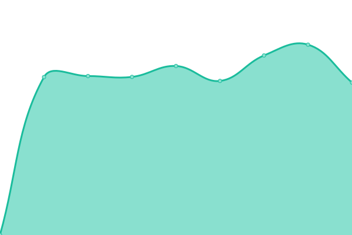
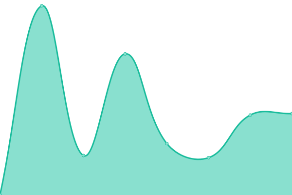
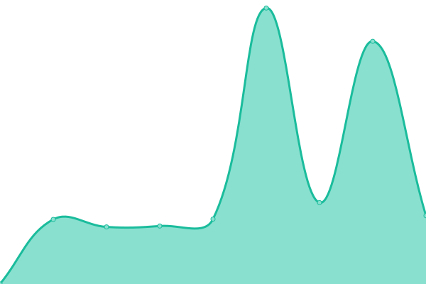
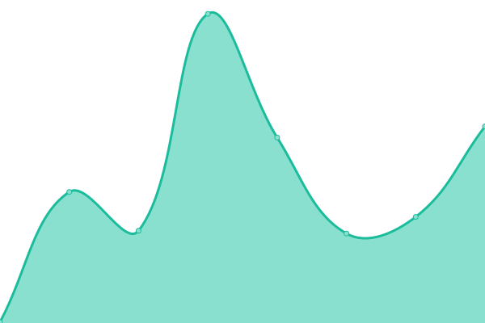
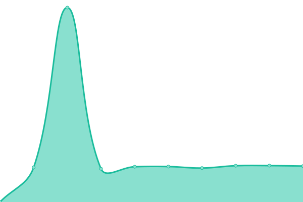
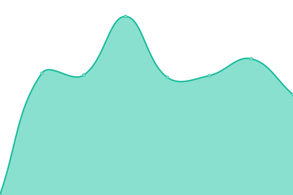
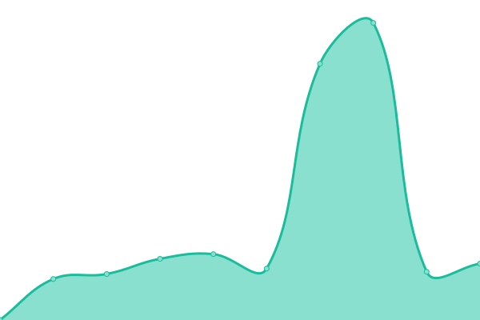

# [📈 Live Status](https://DigitalVoiceNZ.github.io/upptime): <!--live status--> **🟧 Partial outage**

This repository contains the open-source uptime monitor and status page for [Digital Voice NZ](https://dvnz.nz/), powered by [Upptime](https://github.com/upptime/upptime).

With [Upptime](https://upptime.js.org), you can get your own unlimited and free uptime monitor and status page, powered entirely by a GitHub repository. We use [Issues](https://github.com/DigitalVoiceNZ/upptime/issues) as incident reports, [Actions](https://github.com/DigitalVoiceNZ/upptime/actions) as uptime monitors, and [Pages](https://DigitalVoiceNZ.github.io/upptime) for the status page.

<!--start: status pages-->
<!-- This summary is generated by Upptime (https://github.com/upptime/upptime) -->
<!-- Do not edit this manually, your changes will be overwritten -->
<!-- prettier-ignore -->
| URL | Status | History | Response Time | Uptime |
| --- | ------ | ------- | ------------- | ------ |
|  [DVNZ](https://dvnz.nz) | 🟩 Up | [dvnz.yml](https://github.com/DigitalVoiceNZ/upptime/commits/HEAD/history/dvnz.yml) | 

 1321ms
     
 | 

<a href="https://status.dvnz.nz/history/dvnz">99.15%</a>
    

|  [XLX299](https://xlx299.nz) | 🟩 Up | [xlx-299.yml](https://github.com/DigitalVoiceNZ/upptime/commits/HEAD/history/xlx-299.yml) | 

 1872ms
     
 | 

<a href="https://status.dvnz.nz/history/xlx-299">99.96%</a>
    

|  [XLX936](https://xlx.dvnz.nz) | 🟩 Up | [xlx-936.yml](https://github.com/DigitalVoiceNZ/upptime/commits/HEAD/history/xlx-936.yml) | 

 1414ms
     
 | 

<a href="https://status.dvnz.nz/history/xlx-936">99.37%</a>
    

|  [XLX626](https://xlx626.onjapan.net) | 🟩 Up | [xlx-626.yml](https://github.com/DigitalVoiceNZ/upptime/commits/HEAD/history/xlx-626.yml) | 

 665ms
     
 | 

<a href="https://status.dvnz.nz/history/xlx-626">99.63%</a>
    

|  [XLX530](http://124.197.62.162:84) | 🟥 Down | [xlx-530.yml](https://github.com/DigitalVoiceNZ/upptime/commits/HEAD/history/xlx-530.yml) | 

 830ms
     
 | 

<a href="https://status.dvnz.nz/history/xlx-530">78.64%</a>
    

|  [XLX327](https://xlx327.from-ak.com) | 🟩 Up | [xlx-327.yml](https://github.com/DigitalVoiceNZ/upptime/commits/HEAD/history/xlx-327.yml) | 

 338ms
     
 | 

<a href="https://status.dvnz.nz/history/xlx-327">100.00%</a>
    

|  [HBlink](http://hblink.dvnz.nz) | 🟩 Up | [h-blink.yml](https://github.com/DigitalVoiceNZ/upptime/commits/HEAD/history/h-blink.yml) | 

 1313ms
     
 | 

<a href="https://status.dvnz.nz/history/h-blink">100.00%</a>
    

|  [M17-NZD](https://m17-nzd.m1m0n.net/) | 🟩 Up | [m17-nzd.yml](https://github.com/DigitalVoiceNZ/upptime/commits/HEAD/history/m17-nzd.yml) | 

 1232ms
     
 | 

<a href="https://status.dvnz.nz/history/m17-nzd">100.00%</a>
    

|  [M17-327](https://m17-327.from-ak.com) | 🟩 Up | [m17-327.yml](https://github.com/DigitalVoiceNZ/upptime/commits/HEAD/history/m17-327.yml) | 

 206ms
     
 | 

<a href="https://status.dvnz.nz/history/m17-327">100.00%</a>
    

|  [YCS530](http://ycs530.xreflector.net/ycs) | 🟩 Up | [ycs-530.yml](https://github.com/DigitalVoiceNZ/upptime/commits/HEAD/history/ycs-530.yml) | 

 564ms
     
 | 

<a href="https://status.dvnz.nz/history/ycs-530">100.00%</a>
    

|  [IPSC2-ZL](http://dmrplus.arec.info/ipsc) | 🟩 Up | [ipsc-2-zl.yml](https://github.com/DigitalVoiceNZ/upptime/commits/HEAD/history/ipsc-2-zl.yml) | 

 638ms
     
 | 

<a href="https://status.dvnz.nz/history/ipsc-2-zl">100.00%</a>
    

|  [Allstar Node 51178](https://asl.m1m0n.net/allmon2/link.php?nodes=51178) | 🟩 Up | [allstar-node-51178.yml](https://github.com/DigitalVoiceNZ/upptime/commits/HEAD/history/allstar-node-51178.yml) | 

 1240ms
     
 | 

<a href="https://status.dvnz.nz/history/allstar-node-51178">100.00%</a>
    

|  [ZL1HXD Repeater](http://www.zl1hxd.duckdns.org:82) | 🟩 Up | [zl-1-hxd-repeater.yml](https://github.com/DigitalVoiceNZ/upptime/commits/HEAD/history/zl-1-hxd-repeater.yml) | 

 1238ms
     
 | 

<a href="https://status.dvnz.nz/history/zl-1-hxd-repeater">99.69%</a>
    

|  [ZL1OTD Repeater](https://zl1otd.dvnz.nz) | 🟩 Up | [zl-1-otd-repeater.yml](https://github.com/DigitalVoiceNZ/upptime/commits/HEAD/history/zl-1-otd-repeater.yml) | 

 9336ms
     
 | 

<a href="https://status.dvnz.nz/history/zl-1-otd-repeater">98.75%</a>
    

|  [ZL1AMK Repeater](http://zl1amk.ddns.net:82) | 🟩 Up | [zl-1-amk-repeater.yml](https://github.com/DigitalVoiceNZ/upptime/commits/HEAD/history/zl-1-amk-repeater.yml) | 

 2401ms
     
 | 

<a href="https://status.dvnz.nz/history/zl-1-amk-repeater">96.35%</a>
    

|  [ZL2ROR Repeater](https://zl2ror.dvnz.nz) | 🟩 Up | [zl-2-ror-repeater.yml](https://github.com/DigitalVoiceNZ/upptime/commits/HEAD/history/zl-2-ror-repeater.yml) | 

 2576ms
     
 | 

<a href="https://status.dvnz.nz/history/zl-2-ror-repeater">97.94%</a>
    

<!--end: status pages-->

[**Visit our status website →**](https://DigitalVoiceNZ.github.io/upptime)

## 📄 License

- Powered by: [Upptime](https://github.com/upptime/upptime)
- Code: [MIT](./LICENSE) © [Digital Voice NZ](https://dvnz.nz/)
- Data in the `./history` directory: [Open Database License](https://opendatacommons.org/licenses/odbl/1-0/)
